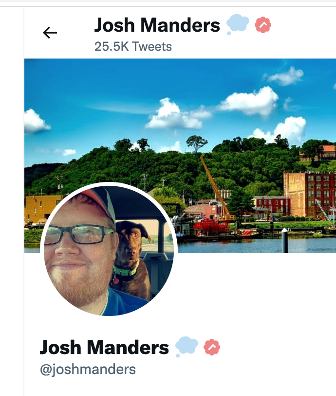

# Who Blue?

This is a joke so please relax. Just showing some cool coding techniques.

A browser extension to separate the lords from the peasants. Turns $8 blue checks into upsidedown pink ones.

Its not on the Chrome store, but you can just load the folder as unpacked. `chrome://extensions/` → `Load Unpacked` → `Select this folder`

## The Code

I made a video on how I built it - you should watch it if you like longer coding videos of people figuring things out:

<a href="https://www.youtube.com/watch?v=l_Ofba5XwLk">
  https://www.youtube.com/watch?v=l_Ofba5XwLk
</a>
